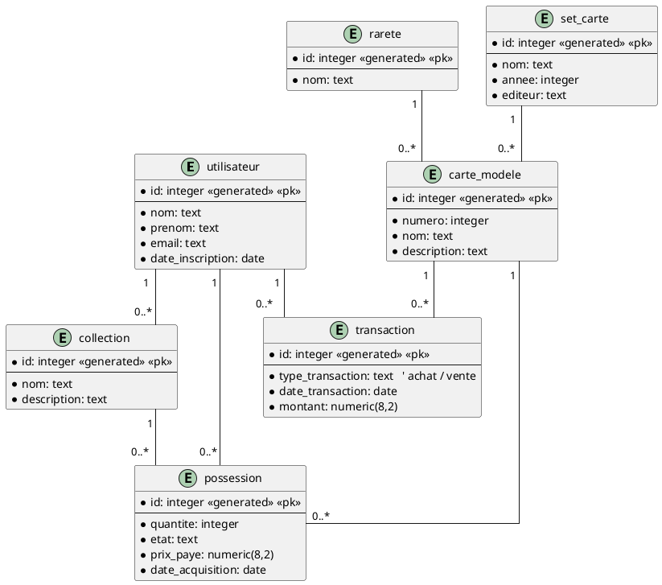
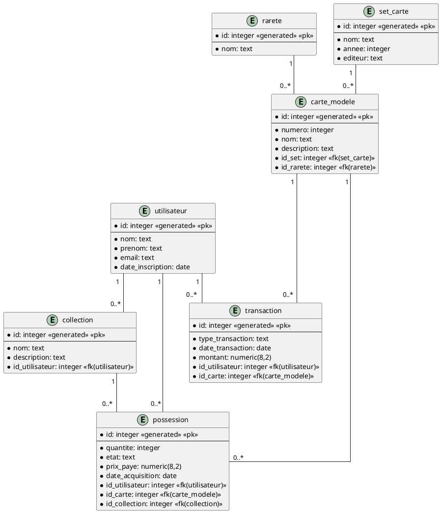

# Projet 420-3N3-DM — Base de données : Gestionnaire de collections de cartes

## 1. Description générale

### 1.1 Contexte

Ce projet consiste à concevoir et implémenter une base de données relationnelle pour un gestionnaire
de collections de cartes.  
L’objectif est de centraliser l’information liée aux cartes de collection (ex. cartes de hockey,
Pokémon, Magic), aux ensembles auxquels elles appartiennent, ainsi qu’aux collections détenues par
différents utilisateurs.

La base de données pourrait servir de fondation à une application permettant à un collectionneur :

- d'organiser ses collections de cartes.
- de suivre les cartes qu’il possède.
- de connaître les cartes manquantes d’un set.
- de documenter la rareté, l’état et la valeur de ses cartes.
- de consulter l’historique des transactions d’achat ou de vente.

### 1.2 Objectifs du système

Les objectifs principaux sont :

- Représenter les **utilisateurs** du système.
- Représenter les **collections** créées par un utilisateur pour organiser ses cartes.
- Représenter les **sets de cartes** publiés par un éditeur pour une année ou une série donnée.
- Décrire les **modèles de cartes** faisant partie d’un set.
- Représenter les **niveaux de rareté** des cartes (commune, rare, parallèle, etc.).
- Enregistrer les **cartes possédées** par un utilisateur (quantité, état, prix payé).
- Enregistrer des **transactions** (achats ou ventes/ajouts ou retraits dans le cas d'un échange
  par exemple) liées à des
  cartes.

Ces informations permettront d’analyser la progression d’un collectionneur dans un set, la valeur de
ses cartes, et son historique d’acquisitions.

### 1.3 Fonctionnalités à supporter

La base de données doit permettre :

- la gestion des profils d’utilisateurs
- la création et la gestion de **collections** personnelles
- la gestion des **sets** et leur description (nom, année)
- la gestion des **modèles de cartes** dans un set (numéro, nom, joueur/personnage, rareté)
- la gestion des **cartes possédées** via une table d’association
- la gestion des **transactions** liées à l’achat ou à la vente de cartes
- la production de statistiques telles que :
    - nombre de cartes possédées par set
    - cartes manquantes
    - valeur totale d’une collection

### 1.4 Principales entités (7)

Le modèle repose sur **7 entités** :

1. **Utilisateur** : représente un collectionneur utilisant le système.
2. **Collection** : regroupe des cartes possédées par un utilisateur.
3. **SetCarte** : représente une série de cartes appartenant à une année ou édition précise.
4. **CarteModele** : décrit un modèle de carte faisant partie d’un set.
5. **Rareté** : décrit le niveau de rareté d’un modèle de carte.
6. **Possession** : représente qu’un utilisateur possède un exemplaire (ou plusieurs) d’un modèle de
   carte.
7. **Transaction** : représente un achat ou une vente d’une carte par un utilisateur.

### 1.5 Associations principales

Les associations prévues pour le modèle logique sont :

- Un **Utilisateur** possède plusieurs **Collections**.
- Un **Utilisateur** détient plusieurs cartes via **Possession**.
- Une **Collection** contient plusieurs **Possession**.
- Un **SetCarte** contient plusieurs **CarteModele**.
- Une **CarteModele** est associée à une **Rareté**.
- Une **CarteModele** peut être liée à plusieurs **Possession**.
- Un **Utilisateur** peut avoir plusieurs **Transaction**.

---

## 2. Modèle logique (DEA)

## 3. Modèle physique (relationnel)

## 4. Scripts SQL

- `collection_cartes_create.sql`
- `collection_cartes_insert.sql`
- `collection_cartes_select.sql`

## 5. Données de test

*(À venir)*

## 6. Requêtes SQL de démonstration

*(À venir — minimum 10 requêtes variées)*
