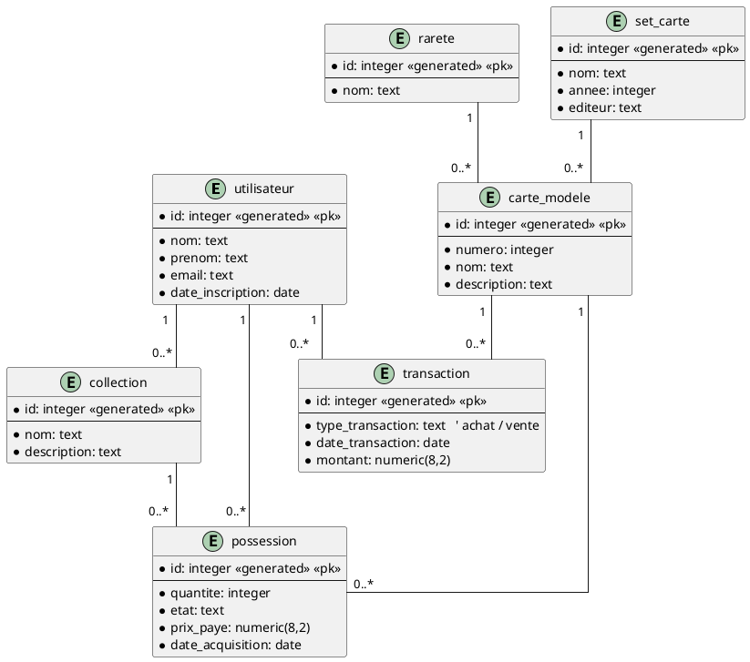
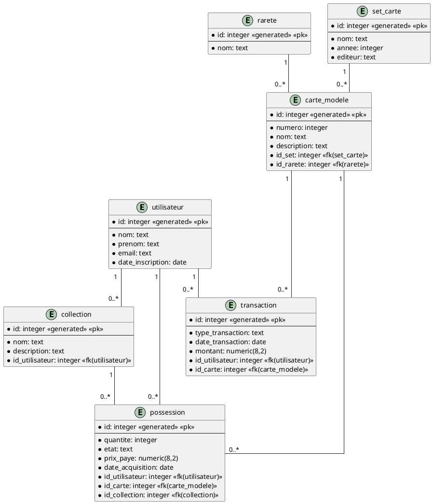

# Diagrammes UML - Gestionnaire de collections de cartes

## Diagramme logique (DEA)

```plantuml
@startuml
skinparam linetype ortho

entity utilisateur {
    * id: integer <<generated>> <<pk>>
    ---
    * nom: text
    * prenom: text
    * email: text
    * date_inscription: date
}

entity rarete {
    * id: integer <<generated>> <<pk>>
    ---
    * nom: text
}

entity set_carte {
    * id: integer <<generated>> <<pk>>
    ---
    * nom: text
    * annee: integer
    * editeur: text
}

entity carte_modele {
    * id: integer <<generated>> <<pk>>
    ---
    * numero: integer
    * nom: text
    * description: text
}

entity collection {
    * id: integer <<generated>> <<pk>>
    ---
    * nom: text
    * description: text
}

entity possession {
    * id: integer <<generated>> <<pk>>
    ---
    * quantite: integer
    * etat: text
    * prix_paye: numeric(8,2)
    * date_acquisition: date
}

entity transaction {
    * id: integer <<generated>> <<pk>>
    ---
    * type_transaction: text   ' achat / vente
    * date_transaction: date
    * montant: numeric(8,2)
}

' Un utilisateur possède plusieurs collections
utilisateur " 1" -- "0..*    " collection

' Un utilisateur possède plusieurs cartes via possession
utilisateur "1 " -- "0..* " possession

' Une collection regroupe plusieurs possessions
collection "1    " -- "0..*" possession

' Une rareté est associée à plusieurs modèles de cartes
rarete "1    " -- "0..*" carte_modele

' Un set contient plusieurs modèles de cartes
set_carte "1" -- "0..*    " carte_modele

' Un modèle de carte peut apparaître dans plusieurs possessions
carte_modele "1   " --- "0..*" possession

' Un utilisateur fait plusieurs transactions
utilisateur "1    " -- "0..*" transaction

' Une transaction concerne un modèle de carte
carte_modele "1" -- "0..*    " transaction

@enduml
```

## Diagramme physique (relationnel)

```plantuml
@startuml
skinparam linetype ortho

entity utilisateur {
    * id: integer <<generated>> <<pk>>
    ---
    * nom: text
    * prenom: text
    * email: text
    * date_inscription: date
}

entity rarete {
    * id: integer <<generated>> <<pk>>
    ---
    * nom: text
}

entity set_carte {
    * id: integer <<generated>> <<pk>>
    ---
    * nom: text
    * annee: integer
    * editeur: text
}

entity carte_modele {
    * id: integer <<generated>> <<pk>>
    ---
    * numero: integer
    * nom: text
    * description: text
    * id_set: integer <<fk(set_carte)>>
    * id_rarete: integer <<fk(rarete)>>
}

entity collection {
    * id: integer <<generated>> <<pk>>
    ---
    * nom: text
    * description: text
    * id_utilisateur: integer <<fk(utilisateur)>>
}

entity possession {
    * id: integer <<generated>> <<pk>>
    ---
    * quantite: integer
    * etat: text
    * prix_paye: numeric(8,2)
    * date_acquisition: date
    * id_utilisateur: integer <<fk(utilisateur)>>
    * id_carte: integer <<fk(carte_modele)>>
    * id_collection: integer <<fk(collection)>>
}

entity transaction {
    * id: integer <<generated>> <<pk>>
    ---
    * type_transaction: text
    * date_transaction: date
    * montant: numeric(8,2)
    * id_utilisateur: integer <<fk(utilisateur)>>
    * id_carte: integer <<fk(carte_modele)>>
}

utilisateur "1" -- "0..*     " collection
utilisateur "1 " -- "0..* " possession
collection "1    " -- "0..*" possession

rarete "1   " -- "0..*" carte_modele
set_carte " 1" -- "0..*   " carte_modele

carte_modele "1  " ---- "0..*" possession
utilisateur "1    " -- "0..*" transaction
carte_modele "1" -- "0..*    " transaction

@enduml
```
